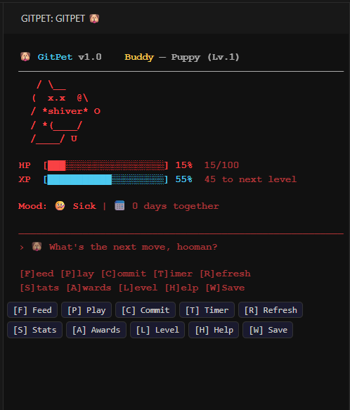

# GitPet 🐶

## Objective
GitPet is a fun, interactive VS Code extension that keeps you motivated by putting a virtual pet right in your sidebar. Your pet grows and levels up alongside your coding sessions, encouraging healthy coding habits, regular commits, and focused work.

## Features
- **Adorable ASCII Art Dog** - Cute animated pet with wagging tail, blinking eyes, and expressive moods
- **Dynamic Animations** - Watch your pet walk around, sniff, scratch, roll over, chase their tail, and more!
- **5 Evolution Levels** - Watch your puppy grow from a tiny ball of fluff to a Legendary Doge with a crown!
- **Smart Dog Tricks** - Your pet performs real git commands as tricks (fetch, status, branch, log, and more!)
- **Repository Health Tracking** - Monitors commit frequency, working tree cleanliness, and more
- **Visual Heatmap** - GitHub-style contribution heatmap showing your last 4 weeks of activity
- **Focus Mode** - Built-in Pomodoro timer to help you stay productive
- **Smart Commits** - AI-assisted commit message suggestions
- **Achievements System** - Unlock achievements for coding milestones
- **XP & Leveling System** - Earn XP through good coding habits and watch your pet evolve
- **Persistent State** - Your pet remembers you between sessions!

## Quick Start
1. **Install the Extension**: Go to the **Extensions** view (`Cmd+Shift+X` or `Ctrl+Shift+X`), select **"Install from VSIX..."** and choose the compiled `.vsix` release file.
2. **Open your project**: Navigate to any git repository in VS Code.
3. **Start GitPet**: Click the GitPet 🐶 icon in your Activity Bar.
4. **Name your pet**: Give your new companion a name!
5. **Watch it react**: See your pet respond to your repository's health as you code!

*(Note: As this is a VS Code extension, you don't need to use `npx git-pet`. Just open the sidebar!)*

## Run Commands & Interacting
Once the extension is active, click the **GitPet 🐶** icon in the Activity Bar sidebar. You can interact with your pet either by clicking the interface buttons or using the keyboard shortcuts while the webview is focused.

### Controls Table (F P C T R S A L H W)
Here are all the keybindings and their corresponding actions:

| Key | Action | Description |
| --- | ------ | ----------- |
| `F` | **Feed** | Feed your pet to restore its Health Points (HP). |
| `P` | **Play** | Play tricks or games with your pet to boost its mood and earn XP. |
| `C` | **Commit** | Trigger smart commit actions directly from your pet's interface. |
| `T` | **Timer** | Start a focus timer to keep your coding session productive. |
| `R` | **Refresh** | Refresh the GitPet UI and fetch the newest pet state. |
| `S` | **Stats** | Check detailed statistics on your coding and pet's well-being. |
| `A` | **Awards** | View unlocked achievements and badges you've earned. |
| `L` | **Level** | See your pet's current Level, HP, XP, and growth stage. |
| `H` | **Help** | Open the help menu for guidance on how to care for your pet. |
| `W` | **Save / Exit** | Force save the current game state and your pet's stats. |
| `Space`| **Quick Interact**| Secondary interaction trigger depending on the current mode. |
| `X` | **Cancel** | Exit out of a running timer or cancel action. |

### Smart Dog Tricks

Your pet can perform real git commands as tricks! Press `P` (Play) to see available tricks. As your pet levels up, more tricks are unlocked. Here are the tricks currently available:

| Trick | Command | Unlock Level |
| ----- | ------- | ------------ |
| Fetch | `git fetch --all` | Level 1 |
| Sniff | `git status --short` | Level 1 |
| Roll Over | `git branch -a` | Level 2 |
| Bury Bone | `git stash list` | Level 2 |
| Sit & Show| `git log --oneline -10` | Level 2 |

## Evolution Levels

| Level | XP Required | Name | Special |
| ----- | ----------- | ---- | ------- |
| 1 | 0 | Puppy | Small and extra cute! |
| 2 | 100 | Young Dog | Unlocks more tricks |
| 3 | 300 | Adult Dog | Gets spotted coat |
| 4 | 600 | Cool Dog | Gets sunglasses! |
| 5 | 1000 | Legendary Doge | Crown and sparkles! |

## Dynamic Animations

Your pet has a variety of idle animations based on their mood:

**Happy/Playful:**
- Walking left and right
- Sniffing the ground
- Scratching behind ear
- Stretching
- Rolling on back
- Chasing tail
- Looking around

**Sad/Sick:**
- Whimpering
- Head down
- Slow walking
- Occasional tears

## Stats Dashboard

Press `S` to see the combined stats screen with:
- **Pet Progress** - Level, HP bar, XP bar, days together
- **Git Heatmap** - Visual 4-week commit activity grid
- **Git Stats** - Total commits, today's commits, streak info
- **Activity** - Total feeds, plays, and scans

The heatmap shows your commit intensity:
- `░` (gray) - No commits
- `▒` (green) - 1 commit
- `▓` (bright green) - 2-3 commits
- `█` (bold green) - 4+ commits

## Focus Mode

Press `T` to start a focus session:
- Choose duration: 15, 25, 45, or 60 minutes
- Your pet cheers you on while you work
- Earn bonus XP for commits made during focus
- Press `Space` to pause/resume
- Press `X` to end early

## How Health is Calculated

GitPet monitors several aspects of your repository:
- **Commit Frequency (30%)** - How often you commit (10+/week = great!)
- **Commit Streak (15%)** - Consecutive days with commits
- **Working Tree (20%)** - Clean tree = happy dog
- **Test Files (15%)** - Having tests shows you care!
- **README (5%)** - Documentation matters
- **Recent Activity (15%)** - When was your last commit?

## Mood States

Your buddy's mood changes based on repository health:
- **Excited (90-100 HP)** - Bouncy, sparkles, maximum tail wags
- **Happy (70-89 HP)** - Wagging tail, big smile
- **Neutral (50-69 HP)** - Calm, small smile
- **Sad (25-49 HP)** - Droopy ears, tears
- **Sick (0-24 HP)** - Shivering, needs help!
- **Sleeping** - After 60 seconds of inactivity (zzz...)

## Tips for a Happy Pet
- Commit frequently (aim for at least 1 commit per day)
- Keep your working tree clean
- Add test files to your project
- Include a `README.md`
- Address TODOs and FIXMEs
- Remove `console.log` statements from production code
- Use focus mode to stay productive!

## Requirements
- VS Code 1.85.0 or higher
- Node.js 18 or higher (if building from source)
- A local git repository

## Screenshots

### Getting Started
*Your new virtual pet greeting you for the first time when you open a git repository.*

### Main Interface
*The interactive GitPet sidebar where you can view your pet's mood, feed it, and see its animations.*
......

### Stats & Progress
*A detailed overview displaying your Git heatmap, current level, and pet HP.*
......

### Features in Action
*Using the Focus Mode timer while working to earn bonus XP.*
......

### Smart Tricks
*Executing actual git commands like `fetch` or `status` directly via your pet's trick menu.*
......

Enjoy your companion and happy coding!
